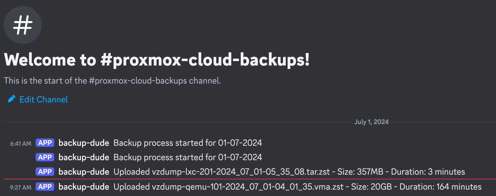

# Proxmox Backup to Google Drive Script

This script uploads Proxmox backups to Google Drive and sends notifications to a Discord webhook. It supports the following features:
- Only uploads `.zst` files created in the last 24 hours.
- Creates a subdirectory on Google Drive with the format `DD-MM-YYYY` and copies the files into it.
- Deletes subdirectories older than a configurable number of days.
- Sends notifications to a Discord webhook when the backup process starts, after each file is uploaded, and when the process is complete.


## Prerequisites

- [rclone](https://rclone.org/downloads/)
- [jq](https://stedolan.github.io/jq/download/)
- A Discord webhook URL

## Setup

1. **Clone the repository:**

    ```sh
    git clone https://github.com/yourusername/proxmox-backup-to-gdrive.git
    cd proxmox-backup-to-gdrive
    ```

2. **Configure the script:**

    Edit the script to set your local directory, remote directory, and Discord webhook URL:

    ```sh
    nano backups_to_gdrive.sh
    ```

    Update the following variables:

    ```sh
    LOCAL_DIR="/path/to/local/backup/directory"
    REMOTE_DIR="remote:Backups/proxmox/"
    BACKUP_LIMIT_DAYS=30  # Number of days to keep
    WEBHOOK_URL="https://discord.com/api/webhooks/your-webhook-id/your-webhook-token"
    ```

3. **Make the script executable:**

    ```sh
    chmod +x backups_to_gdrive.sh
    ```

4. **Create a systemd service and timer:**

    Create a systemd service file:

    ```sh
    sudo nano /etc/systemd/system/backups_to_gdrive.service
    ```

    Add the following content:

    ```ini
    [Unit]
    Description=Backup Proxmox to Google Drive
    After=network.target

    [Service]
    Type=simple
    ExecStart=/path/to/your/script/backups_to_gdrive.sh
    ```

    Create a systemd timer file (or use cron to schedule the script execution):

    ```sh
    sudo nano /etc/systemd/system/backups_to_gdrive.timer
    ```

    Add the following content:

    ```ini
    [Unit]
    Description=Runs backups to Google Drive daily at 5 AM

    [Timer]
    OnCalendar=*-*-* 05:00:00
    Persistent=true

    [Install]
    WantedBy=timers.target
    ```

5. **Enable and start the timer:**

    ```sh
    sudo systemctl daemon-reload
    sudo systemctl enable backups_to_gdrive.timer
    sudo systemctl start backups_to_gdrive.timer
    ```

## Usage

The script will run daily at 5 AM as configured. You can also run it manually:

```sh
./backups_to_gdrive.sh

